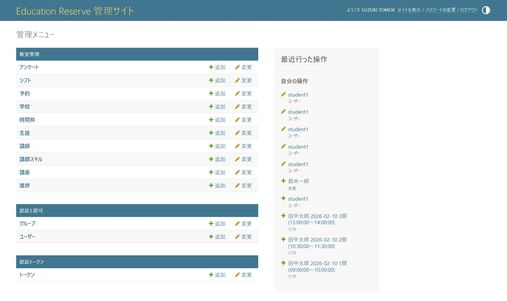
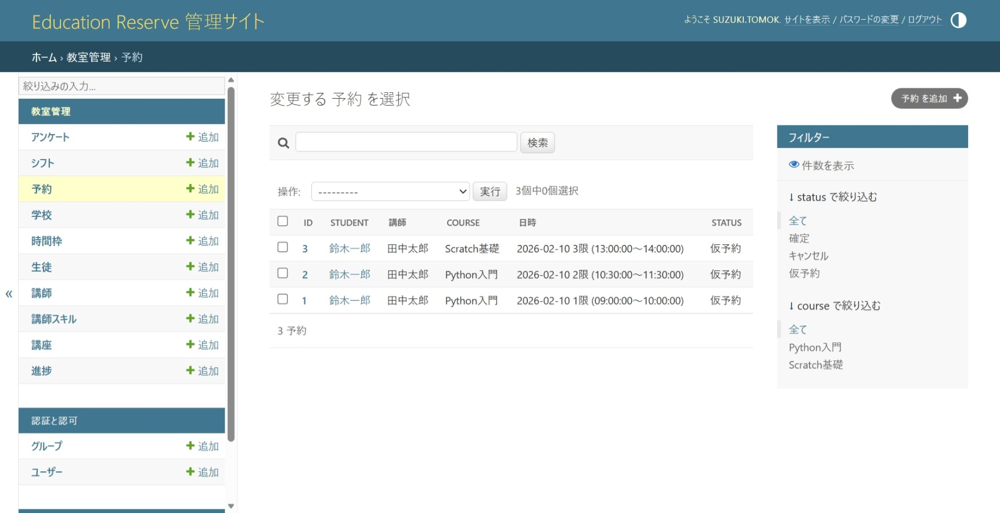
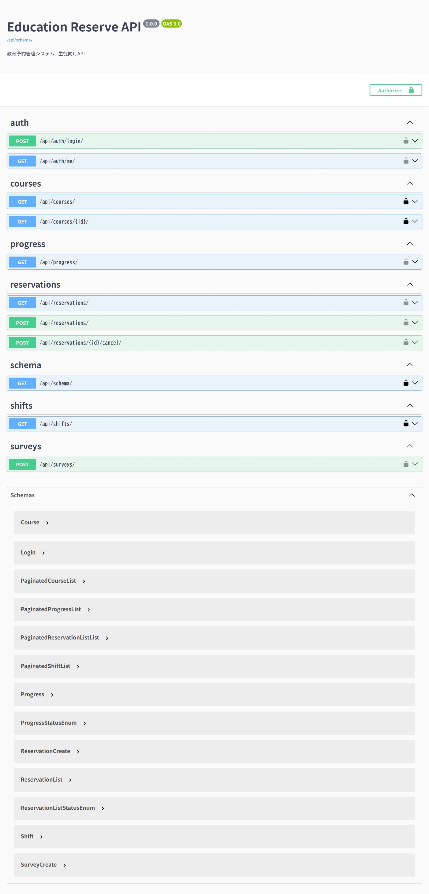

# Education Reserve

教育機関向け予約管理システム

## 技術スタック

- Python 3.11
- Django 5.2
- Django REST Framework
- drf-spectacular（Swagger）
- django-simple-history（変更履歴）
- django-filter
- SQLite（開発） / PostgreSQL（本番）
- pytest + factory-boy（テスト）
- ruff（リンター・フォーマッター）
- GitHub Actions（CI）

## アーキテクチャ

- **Django Admin** — スタッフ向け業務画面（マスタ管理、予約管理、シフト管理、変更履歴の確認）
- **DRF API** — 生徒向け（講座検索、予約、進捗確認、アンケート提出）
- **Swagger UI** — API仕様書・動作確認（/api/docs/）

## 画面イメージ

### Admin画面


### 予約管理


### Swagger UI



## セットアップ
```bash
# リポジトリをクローン
git clone https://github.com/tomokisuzuki/education-reserve.git
cd education-reserve

# 仮想環境の作成・有効化
python -m venv venv
source venv/Scripts/activate

# パッケージインストール（開発）
pip install -r requirements-dev.txt

# マイグレーション
python manage.py migrate

# 管理者ユーザー作成
python manage.py createsuperuser

# 開発サーバー起動
python manage.py runserver
```

### アクセス先

| 画面 | URL |
|------|-----|
| Admin画面 | http://127.0.0.1:8000/admin/ |
| Swagger UI | http://127.0.0.1:8000/api/docs/ |

## API一覧

| メソッド | エンドポイント | 説明 | 認証 |
|---------|--------------|------|------|
| POST | /api/auth/login/ | ログイン | 不要 |
| GET | /api/auth/me/ | ユーザー情報取得 | 必要 |
| GET | /api/courses/ | 講座一覧 | 不要 |
| GET | /api/courses/{id}/ | 講座詳細 | 不要 |
| GET | /api/shifts/ | 空きシフト検索 | 不要 |
| GET | /api/reservations/ | 自分の予約一覧 | 必要 |
| POST | /api/reservations/ | 予約作成 | 必要 |
| POST | /api/reservations/{id}/cancel/ | 予約キャンセル | 必要 |
| GET | /api/progress/ | 自分の進捗 | 必要 |
| POST | /api/surveys/ | アンケート提出 | 必要 |


## 設計判断

### なぜ Django + DRF か
管理者向けAdmin画面と生徒向けAPIの両方が必要なシステムのため、Admin機能が標準で揃っているDjangoを採用。10テーブル構成のデータモデルに対し、API部分はDRFで構築し、1つのフレームワーク内で業務画面とAPIを統一的に管理できる構成にした。

### 認証方式
生徒向けAPIはTokenAuthenticationを採用。SPAやモバイルアプリとの連携を想定し、セッションに依存しないステートレスな認証とした。Admin画面はDjango標準のSessionAuthenticationをそのまま利用。

### テスト設計
factory-boyでテストデータを生成し、テスト間の依存を排除。正常系に加え、認可テスト（他人のデータが見えないこと）やバリデーションの異常系を網羅的にカバーしている。

### インフラ構成（EC2 + RDS）
ポートフォリオとしてのコスト・学習目的を考慮し、EC2上にDocker Compose（Django + Nginx + Gunicorn）を構築。DBはRDSに分離してPrivate Subnetに配置。CloudFormationでIaC化し、VPC・サブネット・セキュリティグループを含むインフラ全体を再現可能にした。もう一つのポートフォリオ（github-analyzer）ではECS Fargateを採用しており、両構成を比較して学んでいる。


## 開発ガイド

### push前の確認手順
```bash
# リントチェック
ruff check .

# フォーマットチェック
ruff format . --check

# フォーマット自動修正
ruff format .

# テスト実行
pytest -v

# カバレッジ付きテスト
pytest -v --cov=apps
```

### CI（GitHub Actions）

`main` ブランチへのpush・PRで自動実行されます。

| ステップ | 内容 |
|---------|------|
| Lint | `ruff check .` / `ruff format . --check` |
| Test | `pytest -v --cov=apps` |

### テスト構成

| ファイル | 内容 |
|---------|------|
| tests/conftest.py | 共通fixture（認証済みクライアント等） |
| tests/factories.py | factory-boyによるテストデータ生成 |
| tests/test_models.py | モデルテスト（制約、デフォルト値） |
| tests/test_api.py | APIテスト（正常系・異常系） |

## Docker環境
```bash
# .env.dockerを作成（初回のみ）
cp .env.docker.example .env.docker

# コンテナ起動
docker compose up --build

# 管理者ユーザー作成（別ターミナルで）
docker compose exec app python manage.py createsuperuser

# コンテナ停止
docker compose down
```

### アクセス先

| 画面 | URL |
|------|-----|
| Admin画面 | http://localhost/admin/ |
| Swagger UI | http://localhost/api/docs/ |

### 構成

| コンテナ | 役割 |
|---------|------|
| app | Django + Gunicorn |
| db | PostgreSQL 16 |
| nginx | リバースプロキシ + 静的ファイル配信 |

## TODO

- [x] プロジェクト構成・settings
- [x] モデル定義（11テーブル + 制約）
- [x] Django Admin（業務画面、一覧編集、一括操作）
- [x] 生徒向けAPI（6エンドポイント）
- [x] TokenAuthentication（ログイン・ユーザー情報API）
- [x] django-simple-history（全モデルの変更履歴）
- [x] Swagger UI（drf-spectacular）
- [x] テスト（pytest + factory-boy）
- [x] CI（GitHub Actions）
- [x] Docker化（アプリ + PostgreSQL + Nginx）
- [x] EC2デプロイ（Nginx + Gunicorn）
- [x] CloudFormation（EC2 + RDS + VPC + SG）
- [x] ER図（Mermaid）
- [x] 業務シーケンス図（Mermaid）
- [x] 予約作成の排他制御（select_for_update）
- [x] StudentSurvey.ratingのDB制約（CheckConstraint）
- [x] 予約キャンセルエンドポイント（POST /api/reservations/{id}/cancel/）
- [x] 同一時間帯の重複予約チェック
- [x] テスト拡充（認可・バリデーション・キャンセル）
- [x] 画面スクショ追加