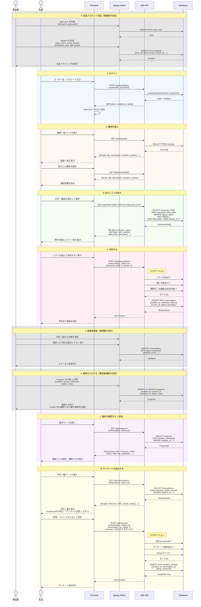

# education-reserve 業務シーケンス図

```mermaid
sequenceDiagram
    actor 管理者
    actor 生徒
    participant FE as Frontend
    participant Admin as Django Admin
    participant API as DRF API
    participant DB as Database

    %% ========== 0. 生徒アカウント作成（管理者） ==========
    rect rgb(230, 230, 230)
        Note over 管理者,DB: 0. 生徒アカウント作成（管理者が対応）
        管理者->>Admin: auth.User を作成<br/>(username, password)
        Admin->>DB: INSERT INTO auth_user
        DB-->>Admin: User
        管理者->>Admin: Student を作成<br/>(user, name, email, school,<br/>enrollment_year, age, grade)
        Admin->>DB: INSERT INTO students<br/>(user_id, name, email, school_id, ...)
        DB-->>Admin: Student
        Admin-->>管理者: 生徒アカウント作成完了
    end

    %% ========== 1. ログイン ==========
    rect rgb(240, 248, 255)
        Note over 生徒,DB: 1. ログイン
        生徒->>FE: ユーザー名・パスワード入力
        FE->>API: POST /api/auth/login/<br/>{username, password}
        API->>DB: authenticate(username, password)
        DB-->>API: User + Student
        API-->>FE: 200 {token, student_id, name}
        FE->>FE: tokenをローカルに保存
    end

    %% ========== 2. 講座一覧を確認 ==========
    rect rgb(255, 248, 240)
        Note over 生徒,DB: 2. 講座を選ぶ
        生徒->>FE: 講座一覧ページを開く
        FE->>API: GET /api/courses/
        API->>DB: SELECT FROM courses
        DB-->>API: Course[]
        API-->>FE: 200 [{id, title, description, duration_weeks}, ...]
        FE-->>生徒: 講座一覧を表示
        生徒->>FE: 受けたい講座を選択
        FE->>API: GET /api/courses/{id}/
        API-->>FE: 200 {id, title, description, duration_weeks}
        FE-->>生徒: 講座詳細を表示
    end

    %% ========== 3. 空きシフト検索 ==========
    rect rgb(240, 255, 240)
        Note over 生徒,DB: 3. 空きシフトを探す
        生徒->>FE: 日付・講座を指定して検索
        FE->>API: GET /api/shifts/?date=2025-02-15&course_id=1
        API->>DB: SELECT instructor_shifts<br/>JOIN instructors, time_slots<br/>WHERE status='open'<br/>AND 予約なし<br/>AND shift_date=? AND course_id=?
        DB-->>API: InstructorShift[]
        API-->>FE: 200 [{id, instructor_name,<br/>shift_date, slot_number,<br/>start_time, end_time}, ...]
        FE-->>生徒: 予約可能なシフト一覧を表示
    end

    %% ========== 4. 予約作成 ==========
    rect rgb(255, 240, 245)
        Note over 生徒,DB: 4. 予約する
        生徒->>FE: シフトを選んで予約ボタン押下
        FE->>API: POST /api/reservations/<br/>Authorization: Token xxx<br/>{instructor_shift: 5, course: 2}

        Note right of API: バリデーション
        API->>DB: シフトがopen？
        API->>DB: 既に予約あり？
        API->>DB: 講師がこの講座を担当可能？
        DB-->>API: すべてOK

        API->>DB: INSERT INTO reservations<br/>(student_id, instructor_shift_id,<br/>course_id, status='pending')
        DB-->>API: Reservation
        API-->>FE: 201 Created
        FE-->>生徒: 予約完了画面を表示
    end

    %% ========== 5. 授業実施 → 予約確定（管理者） ==========
    rect rgb(230, 230, 230)
        Note over 管理者,DB: 5. 授業実施後（管理者が対応）
        管理者->>Admin: 予約一覧から対象を選択
        管理者->>Admin: 「選択した予約を確定にする」実行
        Admin->>DB: UPDATE reservations<br/>SET status='confirmed'<br/>WHERE id IN (...)
        DB-->>Admin: Updated
        Admin-->>管理者: ステータス変更完了
    end

    %% ========== 6. 進捗入力（管理者/講師） ==========
    rect rgb(230, 230, 230)
        Note over 管理者,DB: 6. 進捗を入力する（管理者/講師が対応）
        管理者->>Admin: Progress を作成 or 更新<br/>(student, course, instructor,<br/>status, note)
        Admin->>DB: INSERT or UPDATE progress<br/>(student_id, course_id,<br/>instructor_id, status, note)
        DB-->>Admin: Progress
        Admin-->>管理者: 進捗入力完了<br/>（noteに次の講師への引継ぎ事項を記載）
    end

    %% ========== 7. 進捗確認（生徒） ==========
    rect rgb(248, 240, 255)
        Note over 生徒,DB: 7. 進捗を確認する（生徒）
        生徒->>FE: 進捗ページを開く
        FE->>API: GET /api/progress/<br/>Authorization: Token xxx
        API->>DB: SELECT progress<br/>JOIN courses, instructors<br/>WHERE student_id = ?
        DB-->>API: Progress[]
        API-->>FE: 200 [{course_title, instructor_name,<br/>status, note, last_updated}, ...]
        FE-->>生徒: 講座ごとの進捗・講師メモを表示
    end

    %% ========== 8. アンケート提出 ==========
    rect rgb(255, 255, 235)
        Note over 生徒,DB: 8. アンケートを提出する
        生徒->>FE: 予約一覧ページを開く
        FE->>API: GET /api/reservations/<br/>Authorization: Token xxx
        API->>DB: SELECT reservations<br/>JOIN instructor_shifts, courses<br/>WHERE student_id = ?
        DB-->>API: Reservation[]
        API-->>FE: 200 [{id, instructor_shift, course, status}, ...]
        FE-->>生徒: 予約一覧を表示<br/>（confirmedの予約に「アンケート回答」ボタン）

        生徒->>FE: 評価・コメントを入力して送信
        FE->>API: POST /api/surveys/<br/>Authorization: Token xxx<br/>{reservation: 10, rating: 5,<br/>comment: "わかりやすかった"}

        Note right of API: バリデーション
        API->>DB: 予約がconfirmed？
        API->>DB: アンケート回答済み？
        API->>DB: rating が 1〜5？
        DB-->>API: すべてOK

        API->>DB: INSERT INTO student_surveys<br/>(student_id, reservation_id,<br/>rating, comment)
        DB-->>API: StudentSurvey
        API-->>FE: 201 Created
        FE-->>生徒: アンケート提出完了
    end
```
